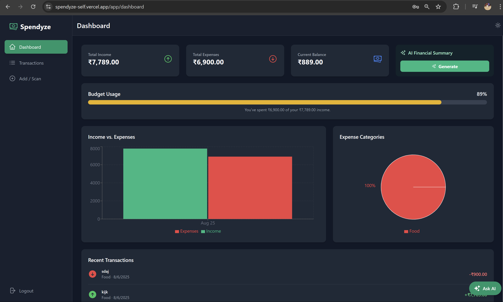
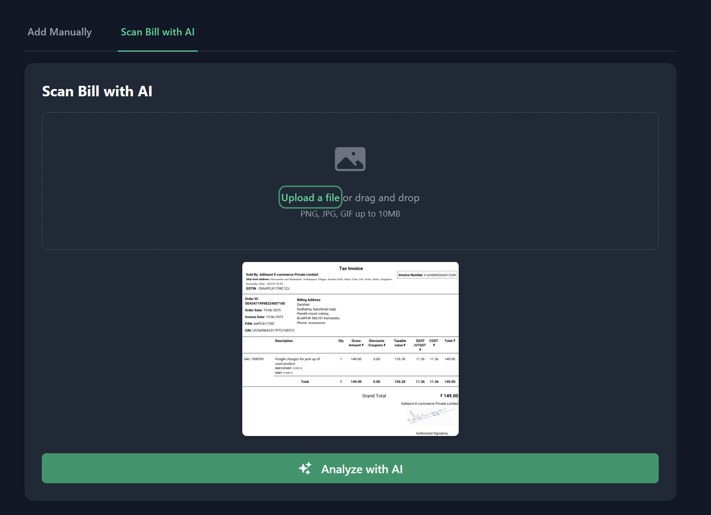
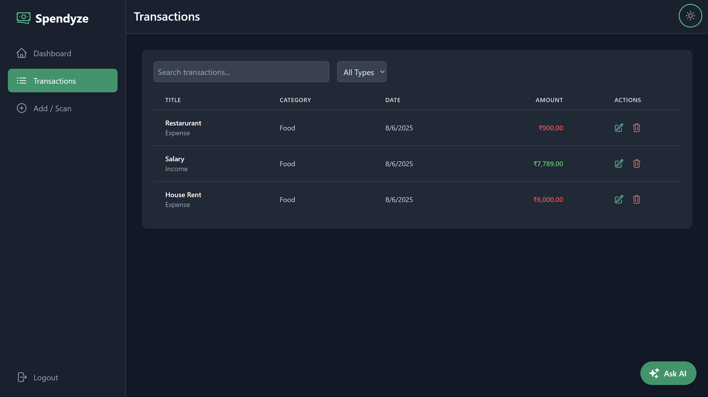
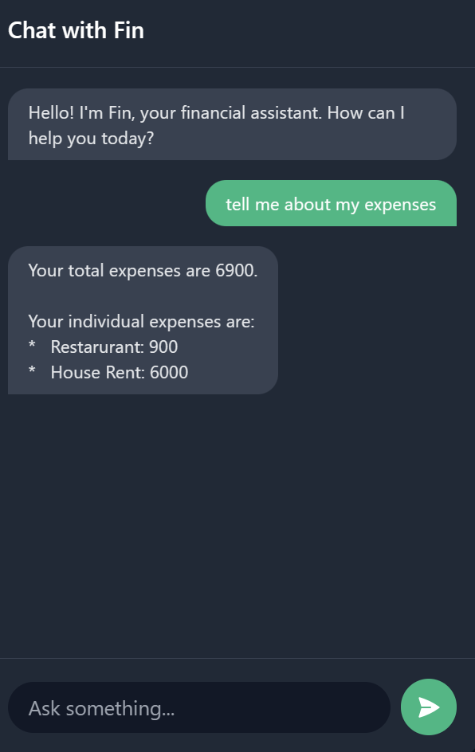
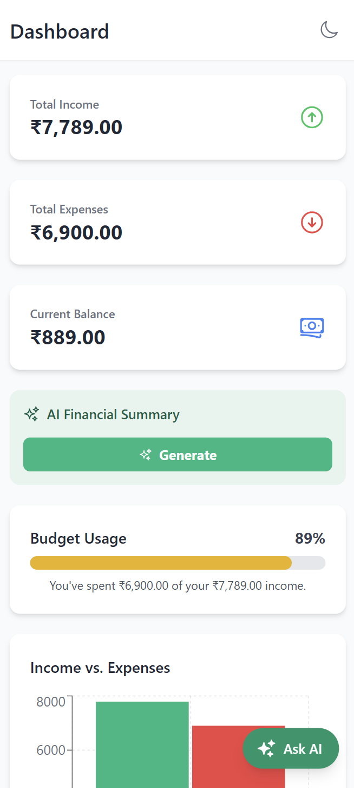

# Spendyze - AI-Powered Personal Finance Tracker



Spendyze is a modern, full-stack web application designed to help users effortlessly manage their personal finances. By integrating Google's Gemini AI, Spendyze goes beyond traditional expense tracking, offering intelligent features like automatic bill scanning, insightful financial summaries, and a conversational AI assistant.

---

## 🚀 Live Demo

[[Link to your deployed application](https://spendyze-self.vercel.app/)]


---

## ✨ Key Features

-   **🔐 Secure Authentication:** Full user registration and login system using JWT for robust security.
-   **📊 Interactive Dashboard:** A central hub displaying total income, expenses, current balance, and a budget usage bar. Features interactive charts for Income vs. Expense and Expense Category distribution.
-   **🤖 AI Bill Scanner:** Upload a picture of a receipt, and the AI automatically extracts the vendor, total amount, date, and suggests a category.
-   **💡 AI Financial Summaries:** Get concise, AI-generated summaries of your recent spending habits, highlighting trends and areas for improvement.
-   **💬 AI Chatbot ("Fin"):** Ask your financial data questions in natural language (e.g., "How much did I spend on food last month?") and get instant answers.
-   **💸 Full Transaction Management:** Complete CRUD (Create, Read, Update, Delete) functionality for both income and expense transactions.
-   **🔔 Budget Tracking & Email Alerts:** Set a budget based on your income and receive automated email alerts when your spending crosses key thresholds (e.g., 80%).
-   **📱 Responsive Design & Dark Mode:** A clean, modern UI that works beautifully on all devices, with a seamless toggle between light and dark themes.

---

## 🛠️ Technology Stack

| Component      | Technologies                                                                          |
| -------------- | ------------------------------------------------------------------------------------- |
| **Frontend**   | React, Vite, Tailwind CSS, Recharts, React Router                                     |
| **Backend**    | Node.js, Express.js                                                                   |
| **Database**   | MongoDB with Mongoose                                                                 |
| **AI**         | Google Gemini API (`@google/genai`)                                                   |
| **Auth**       | JWT (JSON Web Tokens), bcryptjs                                                       |
| **Email**      | Nodemailer                                                                            |

---

## 📸 Screenshots


### AI Scan & Add Transaction

|  |

---

### Transactions List & Filtering

|  |

---

### Chatbot Interface

|  |

---

### Mobile Responsive View

|  |

---

## 🔧 Getting Started & Local Setup

Follow these instructions to get the project up and running on your local machine.

### 1. Prerequisites

-   [Node.js](https://nodejs.org/) (v18 or later recommended)
-   `npm` or `yarn`
-   [MongoDB](https://www.mongodb.com/try/download/community) instance (local or a cloud service like MongoDB Atlas)

### 2. Clone the Repository

```bash
git clone https://github.com/your-username/spendyze.git
cd spendyze
```

### 3. Setup Backend

The backend server handles the API, database interactions, and AI service calls.

```bash
# Navigate to the backend directory
cd backend

# Install dependencies
npm install

# Create a .env file in the /backend directory (see the section below)
touch .env

# Start the backend server (runs on http://localhost:5000)
npm run server
```

### 4. Setup Frontend

The frontend is a React application built with Vite.

```bash
# Navigate back to the project root from the backend directory
cd ..

# Install dependencies for the frontend
npm install

# Start the frontend development server (runs on http://localhost:3000)
npm run dev
```

### 5. Access the App

Once both the frontend and backend servers are running, open your browser and navigate to `http://localhost:3000`.

---

## 🔑 Environment Variables

For the backend server to function correctly, you must create a `.env` file inside the `/backend` directory. Copy the contents of the example below and replace the placeholder values with your actual credentials.

**File: `/backend/.env`**

```env
# MongoDB Connection String
# Get this from your MongoDB Atlas dashboard or local instance
MONGO_URI=mongodb+srv://<user>:<password>@cluster0.mongodb.net/spendyze?retryWrites=true&w=majority

# JWT Secret for signing authentication tokens
# Use a long, random, and secret string
JWT_SECRET=your_super_secret_jwt_key

# Google Gemini API Key
# Get this from Google AI Studio: https://aistudio.google.com/
API_KEY=your_google_gemini_api_key

# --- Nodemailer SMTP Configuration for Email Alerts ---
# If these are not provided, emails will be logged to the console instead of being sent.
# Example using Mailtrap, Brevo, or other SMTP service
SMTP_HOST=smtp.mailtrap.io
SMTP_PORT=2525
SMTP_USER=your_smtp_user
SMTP_PASS=your_smtp_password
FROM_NAME="Spendyze Alerts"
FROM_EMAIL=alerts@spendyze.com
```

---

